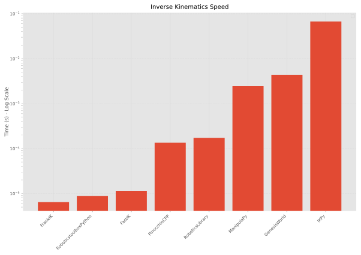

# frankik: Fast Analytical Inverse Kinematics Python Bindings for Franka Robots

**Blazing fast, analytical Inverse Kinematics for Franka Emika Panda and FR3 robots. Lightweight Python bindings, no ROS required.**

`frankik` is a standalone Python library that implements the analytical geometric IK solver proposed by **He & Liu (2021)**. It is designed for researchers and developers who need high-performance kinematics without the overhead of ROS, MoveIt, or hardware drivers.

## Example
```python
import numpy as np
from frankik import FrankaKinematics, RobotType
kinematics = FrankaKinematics(robot_type=RobotType.FR3) # Robot.Type.PANDA also supported
q_home = np.array([0.0, -np.pi / 4, 0.0, -3 * np.pi / 4, 0.0, np.pi / 2, np.pi / 4])
pose_home = kinematics.forward(q_home, tcp_offset=kinematics.FrankaHandTCPOffset)
q = kinematics.inverse(pose_home, tcp_offset=kinematics.FrankaHandTCPOffset, q0=q_home)
assert np.allclose(q, q_home)
print(q)
```

## Installation from source
```shell
git clone https://github.com/juelg/frankik.git
cd frankik
pip install -v .
```
### Development installation
```shell
pip install -ve '.[dev]'
```
### Development Tools
```shell
# python code formatting
make pyformat
# python code linting
make pylint
# cpp code linting
make cpplint
# automatic stubfile generation (for changes in bindings)
make stubgen
```


## Installation from PyPI
Coming soon...


## Speed Benchmark
See the [benchmark folder](benchmark/).
The outcome is based on 1000 seeded random trials (except IKPy, it only has 100 trials).
```shell
===============================================================================================
Library                   | Init (s)   | FK-Small(s)  | IK-Small(s)  | FK-Large(s)  | IK-Large(s) 
-----------------------------------------------------------------------------------------------
FrankIK                   | 0.00000    | 0.0000026    | 0.0000065    | 0.0000027    | 0.0000065   
RoboticstoolboxPython     | 0.81719    | 0.0000145    | 0.0000089    | 0.0000131    | 0.0000107   
FastIK                    | 0.00000    | 0.0000097    | 0.0000114    | 0.0000092    | 0.0000114   
PinocchioCPP              | 0.00205    | 0.0000040    | 0.0001352    | 0.0000039    | 0.0001597   
RoboticsLibrary           | 0.00127    | 0.0000050    | 0.0001733    | 0.0000048    | 0.0001957   
ManipulaPy                | 0.02817    | 0.0002529    | 0.0024451    | 0.0002555    | 0.0025822   
GenesisWorld              | 5.12017    | 0.0017409    | 0.0043826    | 0.0017325    | 0.0019170   
IKPy                      | 0.07299    | 0.0000734    | 0.0671459    | 0.0000723    | 0.0620768   
===============================================================================================
```


